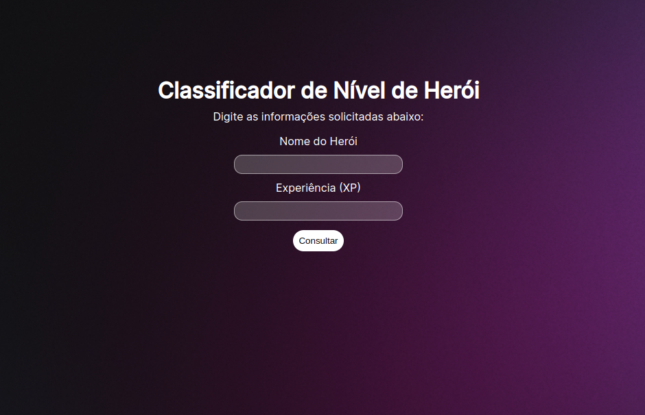

<h1 align="center"> Desafio Classificador de Nível de Herói </h1>

Projeto desenvolvido para fins acadêmicos como proposto pela plataforma <a href="https://www.dio.me/">DIO.me</a>.

  <a href="#-tecnologias">Tecnologias</a>&nbsp;&nbsp;&nbsp;|&nbsp;&nbsp;&nbsp;
  <a href="#-projeto">Projeto</a>&nbsp;&nbsp;&nbsp;|&nbsp;&nbsp;&nbsp;
  <a href="#memo-licença">Licença</a>

  

 

  

## 🚀 Tecnologias

Esse projeto foi desenvolvido com as seguintes tecnologias:

- HTML e CSS
- JavaScript
- Git e Github

## 💻 Projeto

# 1️⃣ Desafio Classificador de nível de Herói
 
Explorar todos os conceitos abordados sobre Variáveis, Operadores, Laços de repetição e Estruturas de decisões.

**O Que deveria ser utilizado**

- Variáveis
- Operadores
- Laços de repetição
- Estruturas de decisões

## Objetivo

Criar uma variável para armazenar o nome e a quantidade de experiência (XP) de um herói, depois utilizar uma estrutura de decisão para apresentar alguma das mensagens abaixo:

Se XP for menor do que 1.000 = Ferro 
Se XP for entre 1.001 e 2.000 = Bronze 
Se XP for entre 2.001 e 5.000 = Prata 
Se XP for entre 6.001 e 7.000 = Ouro 
Se XP for entre 7.001 e 8.000 = Platina 
Se XP for entre 8.001 e 9.000 = Ascendente 
Se XP for entre 9.001 e 10.000= Imortal 
Se XP for maior ou igual a 10.001 = Radiante 

## Saída

Ao final deve se exibir uma mensagem:
"O Herói de nome **{nome}** está no nível de **{nivel}**"

- [Acesse o projeto finalizado, online](https://gabriellricardoo.github.io/dio-lab-classificador-nivel-heroi/)

## :memo: Licença

Esse projeto está sob a licença MIT.

---

Layout feito com ♥ by GR
